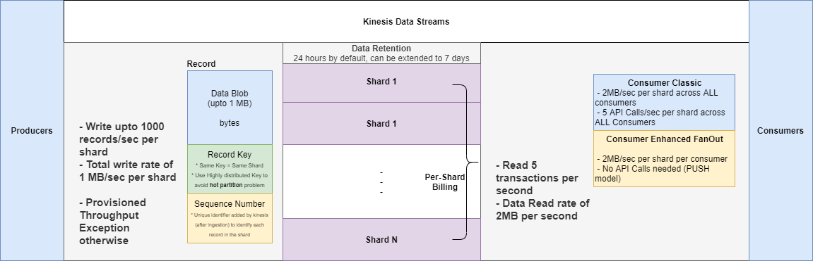
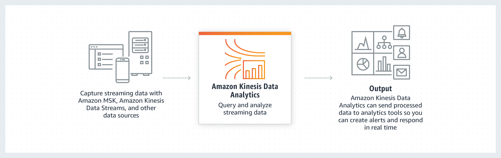
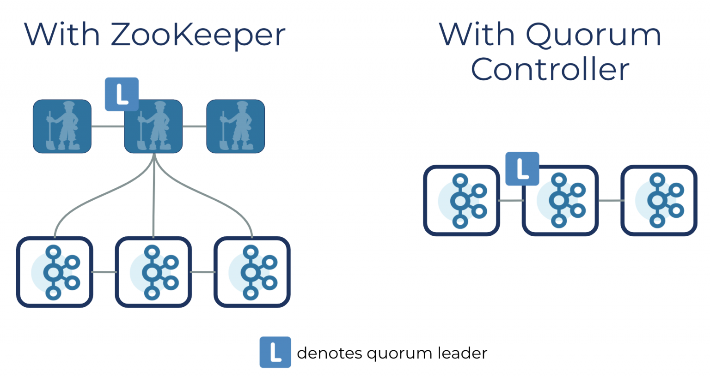
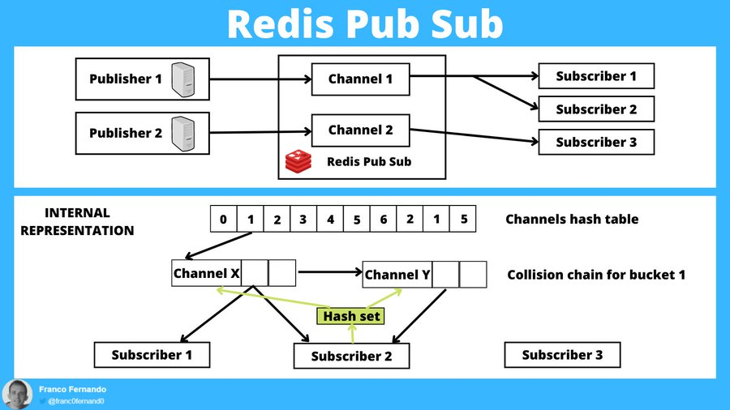

# Introduction

Businesses today receive data at massive scale and speed due to the explosive growth of data sources that continuously generate streams of data. Whether it is 
1. log data from application servers, or 
2. clickstream data from websites and mobile apps, or 
3. telemetry data from Internet of Things (IoT) devices,

it all contains information that can help you learn about what your customers, applications, and products are doing right now. 

Having the ability to process and analyze this data in real-time is essential to do things such as 
1. continuously monitor your applications to ensure high service uptime and 
2. personalize promotional offers and product recommendations. 
3. website analytics and machine learning, 
4. more  accurate and actionable by making data available to these applications in seconds or minutes instead of hours or days.
 

### Real-time Application Scenarios
There are two types of use case scenarios for streaming data applications:
* ##### Evolving from Batch to Streaming Analytics
You can perform real-time analytics on data that has been traditionally analyzed  using batch processing in data warehouses or using Hadoop frameworks. The most common use cases in this category include data lakes, data science, and machine learning. You can use streaming data solutions to continuously load  real-time data into your data lakes. You can also update machine learning models more frequently as new data becomes available, ensuring accuracy and reliability of the outputs. 

* ##### Building Real-Time Applications
You can use streaming data services for real-time applications such as application monitoring, fraud detection, and live leaderboards. These use cases require millisecond end-to-end latencies—from ingestion, to processing, all the way to emitting the results to target data stores and other systems. For example,

### Difference Between Batch and Stream Processing
You need a different set of tools to collect, prepare, and process real-time streaming data than those tools that you have traditionally used for batch analytics. With traditional analytics, you gather the data, load it periodically into a database, and analyze it hours, days, or weeks later. 

Analyzing real-time data requires a different approach. Instead of running database queries over  stored data, stream processing applications process data continuously in realtime, even before it is stored. Streaming data can come in at a blistering pace and data volumes can vary up and down at any time. Stream data processing platforms have to be able to handle the speed and variability of incoming data and process it as it arrives, often millions to hundreds of millions of events per hour.

### Stream Processing Challenges
Processing real-time data as it arrives can enable you to make decisions much  faster than is possible with traditional data analytics technologies. However, building and operating your own custom streaming data pipelines is complicated and resource intensive. 
* You have to build a system that can cost effectively collect, prepare, and transmit data coming simultaneously from thousands of data sources.
* You need to fine-tune the storage and compute resources so that data is batched and transmitted efficiently for maximum throughput and low latency.
* You have to deploy and manage a fleet of servers to scale the system so you can handle the varying speeds of data you are going to throw at it. 
* After you have built this platform, you have to monitor the system and recover from any server or network failures by catching up on data processing from the appropriate point in the stream, without creating duplicate data. 
  
All of this takes valuable time and money and, at the end of the day, most companies just never get there and must settle for the status-quo and operate their business with information that is hours or days old.

# AWS Kinesis

AWS Kinesis is the ***Fully Managed*** alternative to Apache Kafka to collect, process, analyze and store streaming data in real time from hundreds of thousands of sources with very low latencies

Kinesis Components:

### Kinesis Data Streams

Amazon Kinesis Data Streams is a scalable and durable real-time data streaming service that can continuously **capture** gigabytes of data per second from hundreds of thousands of sources like click streams, IoT devices, or metrics and logs from servers directly  

* Streams are divided into Shards or Partitions
* Data retention is 24 hours by default, can go upto 7 days
* You have the ability to reprcoess or replay data (upto the retention period)
* Multiple applications can consume the same stream
* Data is immutable

##### Kinesis Streams Shards

* One stream is made of many different shards
* Billing is per shard provisioned, you can have as many shards as you want
* Batching available or per message calls
* The number of shards can evolve over time (resharding/merge)
* Records are Ordered per shard

###### Scaling for Shards:
Shards cannot be scaled automatically. 
* **Shard splitting** is used to increase the streaming capacity (1 MB/s data in per shard)
* **Shard Merging** is used to decrease stream capacity and save cost.

##### Producers
A Kinesis Data Streams producer is any application that puts user data records into a Kinesis data stream.

The following are the different ways through which the data gets recorded on the streams.
* **Kinesis Producer Library (KPL)** simplifies producer application development, allowing developers to achieve high write throughput to a Kinesis data stream. The KPL can help build high-performance producers addressing multi-threading, batching, retry logic and de-aggregation at the consumer side. KPL Core is built with C++ module and can be compiled to work on any platform with recent c++ compiler.
* ***Kinesis data streams API in AWS SDKs***, allowing users to add multiple records with PutRecords (500) and Single record with PutRecord. KPL is asynchronous by design, so applications that cannot tolerate this additional delay may need to use the AWS SDK directly. 
* **Kinesis agent** allows users to Install on app, web, database server and configure by specifying the files to monitor and the streams for the data. 
* **AWS IoT** integrates directly with Amazon Kinesis.

###### Storage
The producers ingesting real-time data which can be log files, streams (device, social media) or any transactional data. The recommended storage for the same is as listed in below table:

| Type | Storage |
|------|---------|
| Log Files | S3 |
| Streams | Kinesis |
| Transactions | DynamoDB |

##### Consumers
The **Kinesis client library (KCL)** acts as an intermediary between your record processing logic and streams. 

* When a KCL application is started, it calls the KCL to instantiate a worker with configuration information such as stream name and AWS credentials. KCL is compiled in to the application to enable fault-tolerant consumption of data from the stream.
* Applications using KCL or SDK APIs can leverage spot instances to save money as there is guaranteed delivery of data with Streams.
* Event-driven program processing can be accomplished by using the framework’s Kinesis applications (KCL enabled apps), Spark streaming, Storm and AWS Lambda. Kinesis can get stream inputs from the Kinesis producer on Amazon EC2 or from other sources using APIs.
* Consumer is an application that processes all data from a Kinesis data stream. When a consumer uses enhanced fan-out, each consumer registered to use enhanced fan-out receives its own 2MB/sec of read throughput per shard, independent of other consumers.

##### Kinesis Data Firehose

Amazon Kinesis Data Firehose is the easiest way to capture, transform, and **store** Kinesis Data streams into AWS data stores for **near real-time** analytics with existing business intelligence tools.
* Scaling is handled automatically, up to gigabytes per second, and allows for batching, encrypting, and compressing. 
* Firehose also allows for streaming to S3, Elasticsearch Service, or Redshift, where data can be copied for processing through additional services.
* You can also configure Kinesis Data Firehose to transform your data before delivering it. Enable Kinesis Data Firehose data transformation when you create your delivery stream. Then Kinesis Data Firehose invokes your Lambda function to transform incoming source data and deliver the transformed data to destinations.

##### Kinesis Data Analytics

Amazon Kinesis Data Analytics is the used to **continously process** data streams from Data Streams or Data Firehose in real-time with SQL or Apache Flink without having to learn new programming languages or processing frameworks.
* You write application code using SQL to process the incoming streaming data and produce output. You can write SQL statements against in-application streams and reference tables. You can also write JOIN queries to combine data from both of these sources. 
* Kinesis Data Analytics then writes the output to a configured destination. External destinations can be a Kinesis Data Firehose delivery stream or a Kinesis data stream
* You can also define your In-application error stream where all captured errors will be pushed

# Apache Kafka

Apache Kafka is an **open-source** stream-processing software platform developed by the Apache Software Foundation, written in **Scala and Java**. The project aims to provide a unified, high-throughput, low-latency platform for handling real-time data feeds.

Kafka Components

### Broker
* Every broker in Kafka is a "bootstrap server" which knows about all brokers, topics and partitions (metadata), that means Kafka clients (e.g. producer,consumer etc) only need to connect to one broker in order to connect to the entire cluster. If the broker is not a leader for the partition, it throws a NotLeaderForPartitionException, then the client needs to send a metadata request to the same broker for the topic and select the broker hosting the leader replica
* At all times, only one broker should be the controller, and one broker must always be the controller in the cluster
* Does **NO transformation** on the messages and leverages **zero-copy optimisations** to send data straight from the page-cache
* Setting _unclean.leader.election.enable_ to true means we allow out-of-sync replicas to become leaders, knowing that we will lose messages when this occurs. If we set it to false, we choose to wait for the original leader to come back online, resulting in lower availability.

### Controller
* Only one controller in a cluster at all times 
* Monitors the liveness of the brokers, elects new leaders on broker failure, and communicates new leaders to brokers
* Also responsible for managing the states of partitions and replicas and for performing administrative tasks like reassigning partitions.
* Controller election is through **zookeeper**

### ACLs
Access Control Lists (ACLs) provide important authorization controls for your enterprise’s Apache Kafka cluster data.

An **authorizer** is a server plugin used by Apache Kafka to authorize operations. More specifically, an authorizer controls whether or not to authorize an operation based on the principal and the resource being accessed. The default Kafka authorizer implementation is _AclAuthorizer (kafka.security.authorizer.AclAuthorizer)_, which was introduced in Apache Kafka 2.4/Confluent Platform 5.4.0. Prior to that, the authorizer was named _SimpleAclAuthorizer_

* ACLS stored in Zookeeper node /kafka-acl/
* ACLs take "Host" as a parameter, which represents an IP. It can be * (all IP), or a specific IP.

### Kafka Connect 
Kafka Connect is a free, open-source component of Apache Kafka that works as a centralized data hub for simple data integration between databases, key-value stores, search indexes, and file systems
* Kafka Connect Source -> Import data into kafka from extern DB
* Kafka Connect Sink -> Export data from kafka.

### Topic
A Topic is a category/feed name to which records are stored and published.
* All Kafka records are organized into topics. Producer applications write data to topics and consumer applications read from topics.
* Kafka retains records in the log, making the consumers responsible for tracking the position in the log, known as the “offset”. Typically, a consumer advances the offset in a linear manner as messages are read. However, the position is actually controlled by the consumer, which can consume messages in any order. For example, a consumer can reset to an older offset when reprocessing records.
* Records published to the cluster stay in the cluster until a configurable retention period has passed by.
* Kafka takes bytes as input without even loading them into memory (that's called zero copy)
* Using SSL, we need to encrypt data, so Zero copy is lost
* Brokers have defaults for all the topic configuration parameters    
* Dynamic configurations for a topic, eg. passwords, SSL keys etc are stored in Zookeeper

### Partition
Kafka topics are divided into a number of partitions, which contain records in an unchangeable sequence. 
* Each record in a partition is assigned and identified by its unique offset. A topic can also have multiple partition logs. This allows multiple consumers to read from a topic in parallel.   It is not possible to delete a partition of topic once created. 
* Order is guaranteed within the partition and once data is written into the partition, it's immutable!
* If producer writes at 1 GB/sec and consumer consumes at 250MB/sec then we require 4 partitions!

### Segment
Partitions are made of segments (.log files)
* At a time only one segment is active in a partition
* Segment come with two indexes (files)
   * An offset to position index (.index file): Allows kafka where to read to find a message
   * A timestamp to offset index (.timeindex file): Allows kafka to find a message with a timestamp
   
* Sending a message with the null value is called a tombstone in Kafka and will ensure the log compacted topic does not contain any messages with the key K upon compaction

* Log cleanup happen on partition segments. Smaller/more segments means the log cleanup will happen more often!
* The cleaner checks for work every 15 seconds (log.cleaner.backoff.ms)
*  Old segments will be deleted based on log.retention.hours or log.retention.bytes rule
   * log.retention.hours= 1 week (default) number of hours to keep data for
   * log.retention.bytes = -1 (infinite default) max size in bytes for each partition
   
* The offset of message is immutable.
* Deleted records can still be seen by consumers for a period of delete.retention.ms=24 hours (default)
* Important Configurations:

  | Configuration | Description | default |
    |---------------|-------------|---------|
  | log.segment.bytes | Max size of a single segment in bytes | 1 GB |
  | log.segment.ms | Time kafka will wait before closing the segment if not full | 1 week |
  | log.cleanup.policy | Delete data based on age of data | delete (Kafka default for all user topics)|
  |log.cleanup.policy| Delete data based on keys of your messages. Will delete old duplicate keys after the active segment is committed.| compact (Kafka default  for topic __consumer_offsets)|

### Offset
  Each partition has its own offset starting from 0

### Topic Replication
In Kafka, replication is implemented at the partition level. The redundant unit of a topic partition is called a replica. 
* Each partition usually has one or more replicas meaning that partitions contain messages that are replicated over a few Kafka brokers in the cluster.
* Every partition (replica) has one server acting as a leader and the rest of them as followers. **The leader replica handles all read-write requests for the specific partition and the followers replicate the leader.**
* If the lead server fails, one of the follower servers becomes the leader by default. You should strive to have a good balance of leaders so each broker is a leader of an equal amount of partitions to distribute the load.
* When a producer publishes a record to a topic, it is published to its leader. The leader appends the record to its commit log and increments its record offset. Kafka only exposes a record to a consumer after it has been committed and each piece of data that comes in will be stacked on the cluster. 
* A producer must know which partition to write to, this is not up to the broker. 
* It's possible for the producer to attach a key to the record dictating the partition the record should go to. All records with the same key will arrive at the same partition. Before a producer can send any records, it has to request metadata about the cluster from the broker. The metadata contains information on which broker is the leader for each partition, and a producer always writes to the partition leader. The producer then uses the key to know which partition to write to, the default implementation is to use the hash of the key to calculate partition, you can also skip this step and specify partition yourself. 
* A common error when publishing records is setting the same key or null key for all records, which results in all records ending up in the same partition and you get an unbalanced topic.

* Replication factor = 3 and partition = 2 means there will be a total 6 partitions distributed across the Kafka cluster. Each partition will be having 1 leader and 2 ISR (in-sync replica).
*  Broker contains leader partition called leader of that partition and only leader can receive and serve data for partition.
* **Replication-factor can not be greater than the number of brokers in the kafka cluster**. If topic is having a replication factor of 3 then each partition will live on 3 different brokers.

### Producer
Producers are processes that push records into Kafka topics within the broker.

* Automatically recover from errors: LEADER_NOT_AVAILABLE, NOT_LEADER_FOR_PARTITION, REBALANCE_IN_PROGRESS
* Non retriable errors: MESSAGE_TOO_LARGE
* When we produce to a topic which doesn't exist and _auto.create.topic.enable=true_ then kafka creates the topic automatically with the broker/topic settings _num.partition_ and _default.replication.factor_

#### Producer Acknowledgment

* acks=0: Producer do not wait for ack (possible data loss)
* acks=1: Producer wait for leader ack (limited data loss)
* acks=all: Producer wait for leader+replica ack (no data loss)

 acks=all must be used in conjunction with min.insync.replicas (can be set at broker or topic level)

* min.insync.replica=2 implies that at least 2 brokers that are ISR(including leader) must acknowledge
    
e.g. replication.factor=3, min.insync.replicas=2,acks=all can only tolerate 1 broker going down, otherwise the producer will receive an exception NOT_ENOUGH_REPLICAS on send

#### Safe Producer Config
* min.insync.replicas=2 (set at broker or topic level)
* retries=MAX_INT: number of reties by producer in case of transient failure/exception. (default is 0)
* acks=all: Producer wait for leader+replica ack (no data loss)
*  max.in.flight.per.connection=5: number of producer requests can be made in parallel (default is 5). If you also enable retries in a producer, then there is a change of message order not being preserved, except when u use enable.idempotence=true 
* enable.idempotence=true: producer send producerId with each message to identify for duplicate msg at kafka end.
  
When kafka receives a duplicate message with the same producerId which it already committed. It do not commit it again and send ack to producer (default is false)

#### High Throughput Producer using compression and batching
* compression.type=snappy: value can be none(default), gzip, lz4, snappy. 
  Compression is enabled at the producer level and doesn't require any config change in broker or consumer Compression is more effective in case of bigger batch of messages being sent to kafka
* linger.ms=20:Number of millisecond a producer is willing to wait before sending a batch out. (default 0). Increasing linger.ms value increases the chance of batching.
*  batch.size=32KB or 64KB: Maximum number of bytes that will be included in a batch (default 16KB). Any message bigger than the batch size will not be batched

#### Message Key

* Producer can choose to send a key with a message.
* If key= null, data is send in round robin to all the partitions
* If a key is sent, then all messages for that key will always go to the same partition. **This can be used to order the messages for a specific key since order is guaranteed in the same partition.**
* Adding a partition to the topic will lose the guarantee of the same key going to the same partition.
* Keys are hashed using the "murmur2" algorithm by default.

### Consumer
Kafka consumers are the subscribers responsible for reading records from one or more topics and one or more partitions of a topic. 
Kafka is based on Pull based system, as Push can become overwhelmed in scenarios like DDOS attack. The deficiency of a naive pull-based system is that if the broker has no data the consumer may end up polling in a tight loop, effectively busy-waiting for data to arrive. To avoid this we have parameters in our pull request that allow the consumer request to block in a "long poll" waiting until data arrives (and optionally waiting until a given number of bytes is available to ensure large transfer sizes).

* Per thread one consumer is the rule. Consumer must not be multi threaded, while Producers can be shared across threads 
* records-lag-max (most important monitoring metrics) The maximum lag in terms of number of records for any partition in this window. An increasing value over time is your best indication that the consumer group is not keeping up with the producers.
* The high watermark is advanced once all the ISR replicates the latest offsets. A consumer can only read up to the value of the High Watermark (which can be less than the highest offset, in the case of acks=1)
* Consumers do not directly write to the __consumer_offsets topic, they instead interact with a broker that has been elected to manage that topic, which is the Group Coordinator broker 
* If you use consumer.poll(Integer.MAX_VALUE) the consumer will block until a message is fetched. For gracefull immediate shutdown, if you would like to stop consumption you can call consumer.wakeup() (from another thread) and catch the exception to shutdown properly.

#### Consumer Group
Kafka consumers can be part of a consumer group. When multiple consumers are subscribed to a topic and belong to the same consumer group, each consumer in the group will receive messages from a different subset of the partitions in the topic.

* Kafka shell commands use a random consumer group each time they are invoked 
* When a consumer joins a group, if there are still enough partitions available (i.e. we haven’t reached the limit of one consumer per partition), a re-balancing starts and the partitions will be reassigned to the current consumers, plus the new one. In the same way, if a consumer leaves a group, the partitions will be reassigned to the remaining consumers.
*  Other than using the subscribe() method, there is another way for a consumer to read from topic partitions: the assign() method. In this case, the consumer is able to specify the topic partitions it wants to read for.

#### Consumer Offset
When a consumer in a group has processed the data received from Kafka, it commits the offset in Kafka topic named _consumer_offset which is used when a consumer dies, it will be able to read back from where it left off.
* However consumers do not directly write to the __consumer_offsets topic, they instead interact with a broker that has been elected to manage that topic, which is the Group Coordinator broker

##### Delivery Semantics
* **At most once:** Offsets are committed as soon as the message batch is received. If the processing goes wrong, the message will be lost (it won't be read again)
* **At least once (default):** Offsets are committed after the message is processed.If the processing goes wrong, the message will be read again. This can result in duplicate processing of messages. Make sure your processing is idempotent. (i.e. re-processing the message won't impact your systems). For most of the application, we use this and ensure processing is idempotent.
* *Exactly once:** Can only be achieved for Kafka=>Kafka workflows using Kafka Streams API. **For Kafka=>Sink workflows, use an idempotent consumer.**

#### Consumer Offset commit strategy

* enable.auto.commit=true & synchronous processing of batches: with auto commit, offset will be committed automatically for you at regular interval (auto.commit.interval.ms=5000 by default) every time you call .poll().
* If you don't use synchronous processing, you will be in "at most once" behavior because offsets will be committed before your data is processed.
        enable.auto.commit=false & manual commit of offsets (recommended)

#### Consumer Offset reset behavior
* auto.offset.reset=latest: will read from the end of the log
* auto.offset.reset=earliest: will read from the start of the log
* auto.offset.reset=none: will throw exception of no offset is found

**Consumer offset can be lost if you haven't read new data in 7 days. This can be controlled by broker setting offset.retention.minutes**

#### Consumer Poll Behavior
* fetch.min.bytes = 1 (default): Control how much data you want to pull at least on each request. Help improve throughput and decrease request number. At the cost of latency.
* max.poll.records = 500 (default): Controls how many records to receive per poll request. Increase if your messages are very small and have a lot of available RAM.
* max.partition.fetch.bytes = 1MB (default): Maximum data returned by broker per partition. If you read from 100 partition, you will need a lot of memory (RAM)
* fetch.max.bytes = 50MB (default): Maximum data returned for each fetch request (covers multiple partitions). 
  
Consumer performs multiple fetches in parallel.

#### Consumer Heartbeat Thread
* Heartbeat mechanism is used to detect if a consumer application is dead.
 * session.timeout.ms=10 seconds (default) If heartbeat is not sent in 10 second period, the consumer is considered dead. Set lower value to faster consumer rebalances
* heartbeat.interval.ms=3 seconds (default) Heartbeat is sent in every 3 seconds interval. Usually 1/3rd of session.timeout.ms

#### Consumer Poll Thread

Poll mechanism is also used to detect if a consumer application is dead.
*  max.poll.interval.ms = 5 minute (default) Max amount of time between two .poll() calls before declaring consumer dead. If processing of message batches takes more time in general in application then should increase the interval.

### Kafka Guarantees

* Messages are appended to a topic-partition in the order they are sent
* Consumer read the messages in the order stored in topic-partition
* With a replication factor of N, producers and consumers can tolerate upto N-1 brokers being down
* As long as number of partitions remains constant for a topic ( no new partition), the same key will always go to same partition

### Client Bi-Directional Compatibility
* an Older client (1.1) can talk to Newer broker (2.0)
* a Newer client (2.0) can talk to Older broker (1.1)

### Adding Partitions
* Adding partitions doesn't change the partitioning of existing data so this may disturb consumers if they rely on that partition. That is if data is partitioned by hash(key) % number_of_partitions then this partitioning will potentially be shuffled by adding partitions but Kafka will not attempt to automatically redistribute data in any way.
* Kafka does not currently support reducing the number of partitions for a topic or changing the replication factor.

### Zookeeper
Zookeeper is a top-level software developed by Apache that acts as a centralized service and is used to maintain naming and configuration data and to provide flexible and robust synchronization within distributed systems. Zookeeper keeps track of status of the Kafka cluster nodes, and it also keeps track of Kafka topics, partitions etc.

ZooKeeper servers will be deployed on multiple nodes. This is called an ensemble. An ensemble is a set of 2n + 1 ZooKeeper servers where n is any number greater than 0. The odd number of servers allows ZooKeeper to perform majority elections for leadership. At any given time, there can be up to n failed servers in an ensemble and the ZooKeeper cluster will keep quorum. If at any time, quorum is lost, the ZooKeeper cluster will go down.

In Zookeeper multi-node configuration, initLimit and syncLimit are used to govern how long following ZooKeeper servers can take to initialize with the current leader and how long they can be out of sync with the leader.

If tickTime=2000, initLimit=5 and syncLimit=2 then a follower can take (tickTime*initLimit) = 10000ms to initialize and may be out of sync for up to (tickTime*syncLimit) = 4000ms

In Zookeeper multi-node configuration, The server.* properties set the ensemble membership. The format is server.<myid>=<hostname>:<leaderport>:<electionport>. Some explanation:
 * myid is the server identification number. In this example, there are three servers, so each one will have a different myid with values 1, 2, and 3 respectively. The myid is set by creating a file named myid in the dataDir that contains a single integer in human readable ASCII text. This value must match one of the myid values from the configuration file. If another ensemble member has already been started with a conflicting myid value, an error will be thrown upon startup.
* leaderport(3888) is used by followers to connect to the active leader. This port should be open between all ZooKeeper ensemble members.
* electionport(2888) is used to perform leader elections between ensemble members. This port should be open between all ZooKeeper ensemble members.

## KRaft in Kafka 3.3

Apache Kafka Raft (KRaft) is the consensus protocol that was introduced to remove Apache Kafka’s dependency on ZooKeeper for metadata management. This greatly simplifies Kafka’s architecture by consolidating responsibility for metadata into Kafka itself, rather than splitting it between two different systems: ZooKeeper and Kafka. KRaft mode makes use of a new quorum controller service in Kafka which replaces the previous controller and makes use of an event-based variant of the Raft consensus protocol.

## Kafka Streams
Kafka Streams can work as a distributed processing engine and scale horizontally. However, as opposed to Spark or Flink, Kafka Streams does not require setting up a cluster to run the application. Instead, you just start as many instances of the application as you need, and Kafka Streams will rely on Kafka to distribute the load.

To do so, Kafka Streams will register all the instances of your application in the same consumer group, and each instance will take care of some of the partitions of the Kafka topic. As a consequence, the maximum number of instances of your application you can start is equal to the number of partitions in the topic.

Scaling is then made very easy:
* to scale up: start a new instance of the application and it will take over the responsibility of some partitions from other instance
* to scale down: stop an instance and other instances will take care of the no-longer processed partitions.

## Confluent Schema Registry
Schema Registry stores all schemas in a Kafka topic defined by kafkastore.config=_schemas (default) which is a single partition topic with log compacted.

* Schema Registry is included in Confluent Enterprise and Confluent Open Source.
* The default response media type application/vnd.schemaregistry.v1+json, application/vnd.schemaregistry+json, application/json are used in response header.
* HTTP and HTTPS client protocol are supported for schema registry.
* Prefix to apply to metric names for the default JMX reporter kafka.schema.registry
* Default port for listener is 8081
* Confluent support primitive types of null, Boolean, Integer, Long, Float, Double, String, byte[], and complex type of IndexedRecord. Sending data of other types to KafkaAvroSerializer will cause a SerializationException
* Enforces compatibility rules as well as stores schemas
  
###Schema Compatibility Types
  
##### BACKWARD
* Consumer using schema X can process data produced with schema X or X-1.
* In case of BACKWARD_TRANSITIVE, consumer using schema X can process data produced with all previous schema X, X-1, X-2 and so on 
* Delete field without default value (Required field) is allowed. In this case, Consumer ignore this field.
* Add field with default value (Optional field) is allowed. In this case, Consumer will assign default value.
* BACKWARD is default compatibility type in confluent schema registry.
* There is no assurance that consumers using older schema can read data produced using the new schema. Therefore, upgrade all consumers before you start producing new events.

##### FORWARD
* Data produced using schema X can be ready by consumers with schema X or X-1. In case of FORWARD_TRANSITIVE, data produced using schema X can be ready by consumers with all previous schema X, X-1, X-2 and so on
* Add field without default value (Required field) is allowed. In this case, Consumer ignore this field.
* Delete field with default value (Optional field) is allowed. In this case, Consumer will assign default value.
* There is no assurance that consumers using the new schema can read data produced using older schema. Therefore, first upgrade all producers to using the new schema and make sure the data already produced using the older schema are not available to consumers, then upgrade the consumers.
  
##### FULL
* Backward and forward compatible between schema X and X-1. In case of FULL_TRANSITIVE, backward and forward compatible between all previous schema X and X-1 and X-2 and so on
* Modify field with default value (Optional field) is allowed.
* There are assurances that consumers using older schema can read data produced using the new schema and that consumers using the new schema can read data produced using older schema. Therefore, you can upgrade the producers and consumers independently.
  
#### NONE
* Compatibility type means schema compatibility checks are disabled.
* Upgrading Consumer or Producer depends. For example, modifying a field type from Number to String. In this case, you will either need to upgrade all producers and consumers to the new schema version at the same time

# AWS MSK Solution
But there is, however, a third contender. While it is not a standalone platform like Kafka and Kinesis, it is a streaming data service that manages Apache Kafka infrastructure and operations. This makes it easy for developers and DevOps managers to run Apache Kafka applications on AWS. All without the need to become experts in operating Apache Kafka clusters or having a dedicated team to manage it.

**While Kafka is highly customizable, it does take a massive amount of effort to maintain and run. Plus it’s not something to invest in without proper infrastructure.** But Amazon MSK takes care of this loophole. It does this by operating and maintaining Apache Kafka clusters. Plus provides enterprise-grade security features from the start. It has built-in AWS integrations that accelerate the development of streaming data applications. So in the battle of AWS Kinesis vs Kafka, MSK might actually be the hidden underdog.

# Kafka vs Kinesis Comparison

| Concept |	Apache Kafka |	AWS Kinesis Data Streams |
|---------|--------------|---------------------------|
|Data Storage |	Partitions |	Shards |
|Data Ordering |	In partition level	| In shard level |
| Data Retention|	No maximum (configurable)	| 1 to 7 days (default is 24 hours)|
|Data Size Per Blob |	Default 1MB (but can be configured) |	Maximum 1 MB |
|Partition/Shard Modification|	Increase only and does not repartition existing data|	Re-shard by merging or splitting shards|
|Partition/Shard Limitation	| No limit. Optimal partitions depend on the use case|	500 shards in US East (N. Virginia), US West (Oregon), and EU (Ireland) regions. 200 shards in all other regions.|
|Data Replication/DR |	Cluster mirroring |	Automatically across 3 Availability Zones |
| Message Delivery Semantics |	Kafka guarantees at-least-once delivery by default. Kafka supports exactly-once delivery in Kafka Streams	| Kinesis Data Streams has at least once semantics |
| Security |	Either SSL or SASL and authentication of connections to Kafka Brokers from clients; authentication of connections from brokers to ZooKeeper; data encryption with SSL/TLS	| Data can be secured at-rest by using server-side encryption and AWS KMS master keys on sensitive data within KDS. Access data privately via your Amazon Virtual Private Cloud (VPC) |
| Monitoring |	Yammer Metrics for metrics reporting in the server	| AWS CloudWatch and CloudTrail |
| Dependency |	ZooKeeper	| DynamoDB |
| Cost |	Requires a lot of human support on installation, set up, configuration and clusters management. | Pay and use |

# Redis Pub/Sub

Redis is commonly known as a key-value server, but actually is also a messaging server.

Redis Pub/Sub uses a data type called channel to support publish and subscribe operations.

A client can subscribe to multiple channels and a channel can have 0 or multiple subscribers.

When new content is published on a channel, Redis push it out to the subscribers.

Publishers and subscribers are loosely coupled because they interact only through channels. 

**Redis uses an at-most-once delivery semantic to send messages to the subscribers.**  
This means that only (and all) currently connected subscribers get the messages.

Once a message is delivered to all subscribers, it is deleted from the channel. So the data going through a channel is stateless and is simply dropped if there are 0 subscribers. Disconnected subscribers or later subscribers won't get any copy of past messages.

**Redis keep track of channels and subscribers using hash tables as underlying data structures.**
1. "HashTable 1" with chaining collision handling is used to map channels to subscribers.
Subscribers are here stored using a linked list for fast iteration during a publish.
2. "HashTable 2" is used as a set to store all the channels subscribed by a client.

Clearly the 2 hash tables are kept in sync.

These are its most appropriate use cases:
1. Real-time, low-latency messaging where messages are only relevant to subscribers for a short time
2. Unreliable delivery messaging where messages lost is not critical
3. Cases where the number of subscribers and patterns per channel is relatively small
4. Subscribers require at-most-once delivery because target systems can't detect duplicates or are not idempotent
